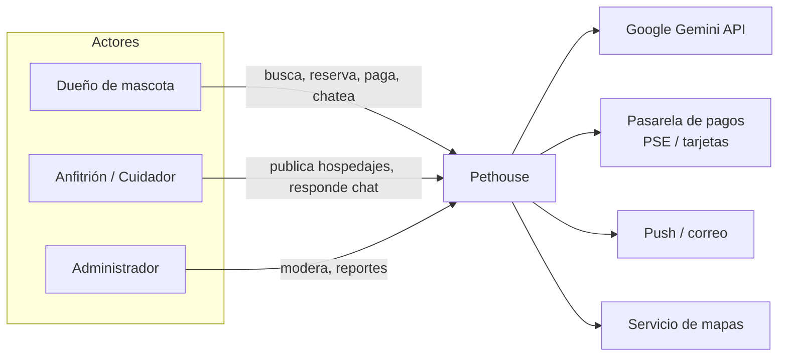
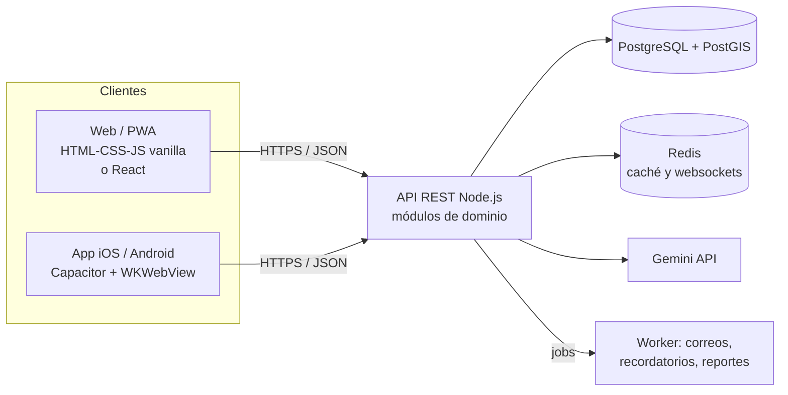
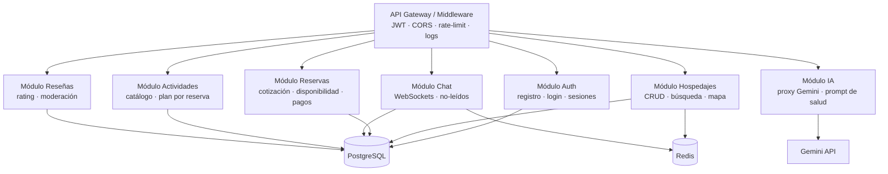
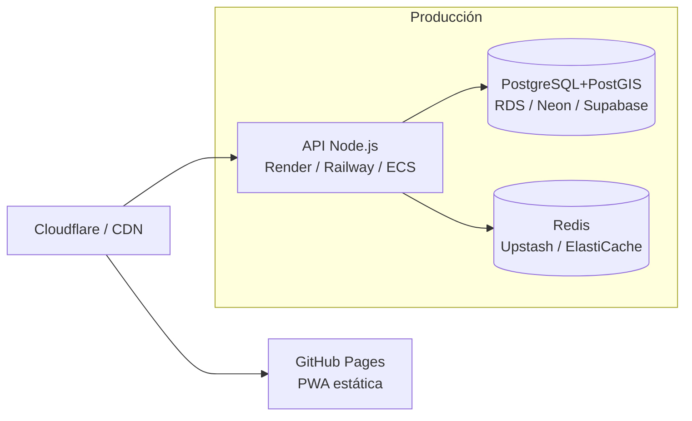

# 🏗️ Pethouse · Arquitectura de Software

> Versión: 1.0 · Fecha: 2026-08-08 · Autor: Ingeniería Pethouse
> Alcance: plataforma de hospedaje de mascotas (marketplace tipo Airbnb para mascotas),
> app iOS/Android, web y API.

---

## 1. Resumen ejecutivo

Pethouse es un **marketplace de hospedaje para mascotas**: dueños que viajan encuentran
guarderías, veterinarias, casas campestres, apartamentos y **cuidadores a domicilio**, con
reserva, pago, chat interno, reseñas y un **asistente de IA** de salud veterinaria.

**Decisión central de la arquitectura:** un **monolito modular** (API Node.js + PostgreSQL/PostGIS)
con separación estricta de dominios internos. Se eligió así por: equipo pequeño, tiempo de
mercado, y porque los volúmenes esperados (miles de reservas/día, no millones) no justifican
microservicios; el monolito modular permite **evolucionar a microservicios** por dominio sin
reescribir (los módulos ya se comunican por contratos).

**Diferenciadores técnicos:**
- 🗺️ **Geolocalización real** con PostGIS (búsqueda por radio, cobertura de cuidadores).
- 🤖 **IA de salud** con Gemini (clave en servidor, no en cliente).
- 📱 **PWA + app nativa** (Capacitor) compartiendo el mismo frontend.
- 🔒 Acceso restringido: reservar/chat exigen autenticación JWT.

---

## 2. Vista de contexto (C4 — Nivel 1)



**Sistemas externos:**
| Sistema | Uso | Fase |
|---|---|---|
| Google Gemini API | Asistente de salud "Dr. Pethouse" (clave en servidor) | ✅ actual |
| Pasarela de pagos (PSE/tarjetas, ej. Wompi/PayU) | Cobro de reservas | ⏳ roadmap |
| Notificaciones push (APNs/FCM) y correo | Confirmaciones, mensajes, recordatorios | ⏳ roadmap |
| Mapas (Mapbox/Leaflet) | Vista de mapa enriquecida | ⏳ roadmap (hoy: SVG propio) |

---

## 3. Vista de contenedores (C4 — Nivel 2)



| Contenedor | Tecnología | Responsabilidad |
|---|---|---|
| **Web/PWA** | HTML+CSS+JS (actual) o React (variante) | UI responsive, PWA instalable, mapa SVG |
| **App nativa** | Capacitor (iOS/Android) | Envoltorio nativo sobre la misma web |
| **API** | Node.js (Express/Fastify) | REST + WebSockets, módulos de dominio |
| **Base de datos** | PostgreSQL 16 + PostGIS 3 | Persistencia, búsqueda espacial, transacciones |
| **Cache/Broker** | Redis | Sesiones, caché de búsqueda, pub/sub chat |
| **Workers** | Node (BullMQ) | Correos, recordatorios, agregaciones |

---

## 4. Vista de componentes (API — Nivel 3)



**Contratos entre módulos:** cada módulo expone una interfaz (rutas REST + funciones de servicio);
el módulo de Reservas consume `Hospedajes.obtener()` y `Pagos.cobrar()` vía inyección, nunca
directamente la tabla de otro módulo. Esto es lo que permite extraer un módulo a microservicio
después sin reescribir.

---

## 5. Modelo de datos (PostgreSQL/PostGIS)

→ **Documentación completa y SQL listo en [`../db/`](../db/)**

Resumen de las 13 tablas:

```
usuarios ──┬── mascotas
           ├── hospedajes ──(GEOGRAPHY(POINT))── 🗺️ índice GIST
           │     ├── cobertura_radio_m (cuidadores a domicilio)
           │     ├── actividades
           │     ├── resenas ──(trigger→rating)
           │     └── reservas ──(daterange + EXCLUDE anti-traslape)
           │            ├── plan_actividades
           │            └── pagos
           ├── conversaciones ── mensajes
           ├── favoritos
           └── sesiones
```

**Lo destacable:**
- `hospedajes.ubicacion GEOGRAPHY(POINT,4326)` + **índice GIST** → búsquedas por radio en ms.
- `cobertura_radio_m` → los cuidadores a domicilio se resuelven con `ST_DWithin` contra la dirección del cliente.
- `reservas` con `daterange` y **restricción EXCLUDE** → la base impide dobles reservas solapadas.
- Columnas `total`/`noches` **generadas** → cero desincronización de precios.
- Función `buscar_hospedajes(lat, lng, radio, fechas, tipo, convivencia, texto)` → un solo round-trip para el buscador.

---

## 6. Decisiones arquitectónicas (ADR resumido)

| # | Decisión | Alternativa descartada | Motivo |
|---|---|---|---|
| ADR-1 | **Monolito modular** | Microservicios desde el día 1 | Velocidad + dominio pequeño; módulos ya aislados por contrato |
| ADR-2 | **PostgreSQL + PostGIS** | MongoDB + cálculo de distancias en app | Integridad transaccional de reservas/pagos + consultas espaciales reales |
| ADR-3 | **JWT (access 15 min + refresh rotativo)** | Sesiones de servidor puras | Stateless para escalar horizontal, revocación vía `sesiones` |
| ADR-4 | **WebSockets (Redis pub/sub) para chat** | Polling HTTP | Latencia y orden garantizados; escala con Redis |
| ADR-5 | **IA por proxy del servidor** (`/api/ia`) | Clave Gemini en el cliente | Seguridad: la clave nunca viaja al navegador; permite auditoría y rate-limit |
| ADR-6 | **Frontend único (web = app)** con Capacitor | React Native / SwiftUI nativo | Máximo reuso: la PWA y la app comparten 100% del código |
| ADR-7 | **Pagos en fase 2** (la reserva hoy es confirmación sin cobro) | Pagos desde el MVP | Reduce riesgo regulatorio/fintech en el lanzamiento |
| ADR-8 | **Mapa SVG embebido hoy** → Mapbox después | Mapbox desde el inicio | Offline-first y sin dependencia externa en el MVP |

---

## 7. API REST (contrato propuesto)

| Método | Ruta | Autenticación | Descripción |
|---|---|---|---|
| POST | `/api/auth/registro` | — | Alta de usuario |
| POST | `/api/auth/login` | — | Login (access + refresh) |
| GET | `/api/hospedajes` | — | Listado + filtros (usa `buscar_hospedajes()`) |
| GET | `/api/hospedajes/:id` | — | Detalle con anfitrión y reseñas |
| GET | `/api/hospedajes/cerca?lat&lng&radio` | — | Búsqueda por radio (PostGIS) |
| POST | `/api/reservas` | ✅ | Crear reserva (valida disponibilidad en transacción) |
| GET | `/api/reservas/mias` | ✅ | Reservas del usuario |
| POST | `/api/reservas/:id/cancelar` | ✅ | Cancelación |
| POST | `/api/chat/:hostId/mensajes` | ✅ | Enviar mensaje |
| WS | `/ws/chat` | ✅ | Canal de mensajería en vivo |
| GET/POST | `/api/actividades` | lectura/✅ | Catálogo y agregar al plan |
| POST | `/api/hospedajes/:id/resenas` | ✅ | Reseña (una por reserva) |
| POST | `/api/ia` | ✅ | Proxy a Gemini (validado y limitado) |

---

## 8. Despliegue



| Pieza | Servicio sugerido | Nota |
|---|---|---|
| Web/PWA | GitHub Pages (ya activo) | Estática, actualiza sola en cada push |
| API | Render/Railway (contenedor Docker) | Escala a 0, ideal para empezar |
| PostgreSQL+PostGIS | Neon / Supabase / RDS | PostGIS disponible en todos |
| Redis | Upstash / ElastiCache | Sesiones + pub/sub |
| Almacenamiento | S3/Cloudinary | Fotos de hospedajes |

**Entornos:** `dev` (Docker local: `db/docker-compose.yml`) · `staging` · `prod`.

---

## 9. Seguridad

- Contraseñas con **bcrypt/argon2**; JWT con refresh rotativo y revocación (`sesiones`).
- **La clave de Gemini solo vive en el servidor** (variable de entorno / secret).
- CORS restringido; rate-limiting por IP/usuario en `/api/ia` y auth.
- SQL parametrizado (las funciones PL/pgSQL ya lo garantizan); nunca concatenar.
- RLS (Row Level Security) recomendado en `mensajes`, `reservas` y `pagos`.
- Backups diarios + PITR (point-in-time recovery) del PostgreSQL.

---

## 10. Roadmap de implementación

| Fase | Entregables |
|---|---|
| **F1 · Base (actual)** | Frontend completo + PWA + app Capacitor + IA + mapa + mock de datos ✅ |
| **F2 · API real** | API Node con los 8 módulos + auth JWT + conexión a `db/` |
| **F3 · Pagos** | Integración PSE/tarjetas, factura electrónica, reembolsos |
| **F4 · Escala** | Redis, workers de correo, CDN de imágenes, RLS, observabilidad |
| **F5 · Crecimiento** | Extraer módulos a servicios (si el tráfico lo justifica), multi-idioma, dark mode |

---

*Documento vivo: se actualiza con cada decisión relevante (nuevo ADR).*
